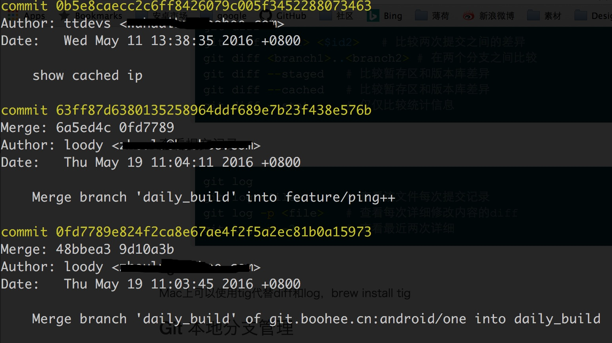
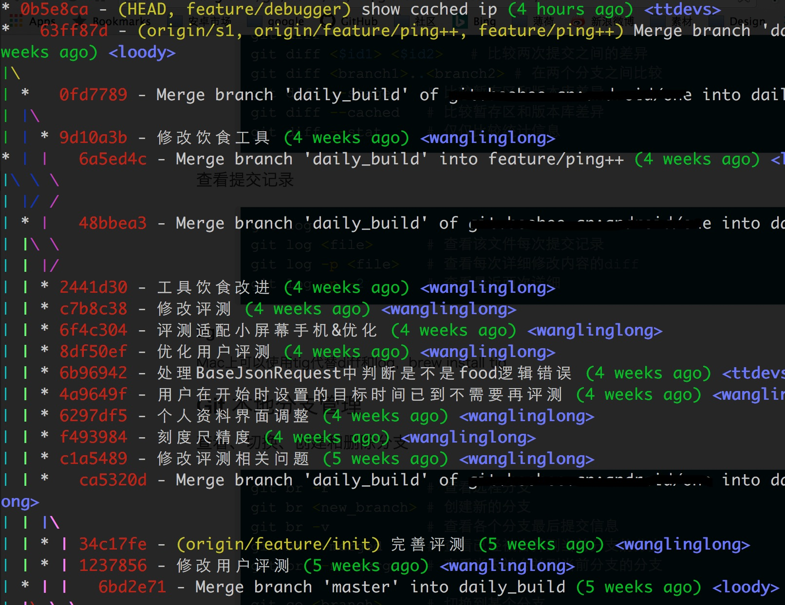
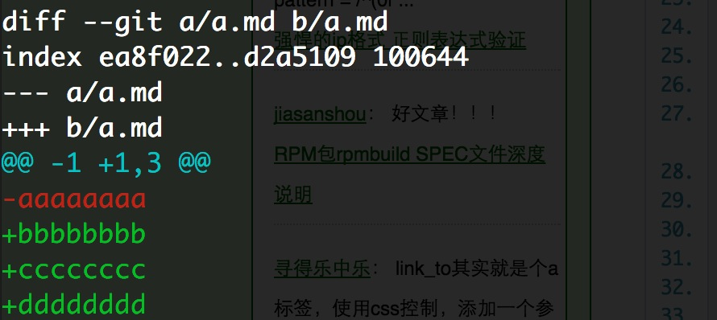
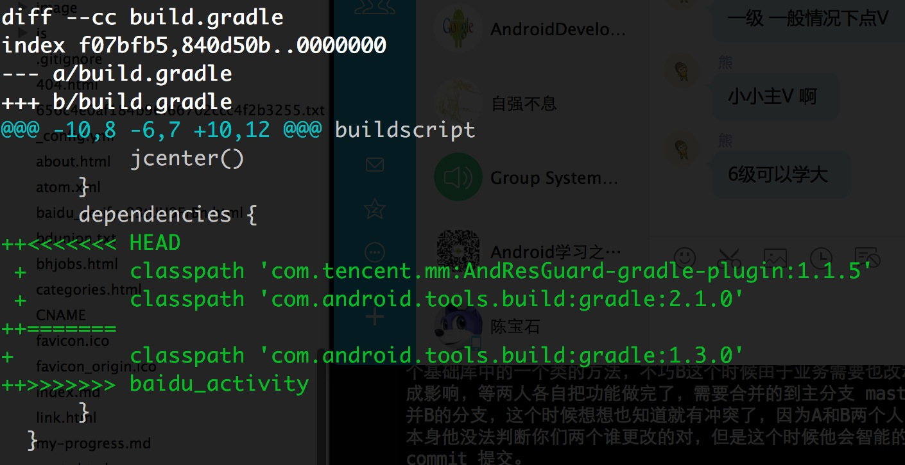

# 从0开始学习 GitHub 系列之「05.Git 进阶」

关于 [Git](http://lib.csdn.net/base/git) 相信大家看了之前一系列的文章已经初步会使用了， 但是关于Git还有很多知识与技巧是你不知道的，今天就来给大家介绍下一些 Git 进阶的知识。

## 1. 用户名和邮箱

我们知道我们进行的每一次commit都会产生一条log，这条log标记了提交人的姓名与邮箱，以便其他人方便的查看与联系提交人，所以我们在进行提交代码的第一步就是要设置自己的用户名与邮箱。执行以下代码：

```bash
git config --global user.name "stormzhang"
git config --global user.email "stormzhang.dev@gmail.com"
```

以上进行了全局配置，当然有些时候我们的某一个项目想要用特定的邮箱，这个时候只需切换到你的项目，以上代码把 **–global** 参数去除，再重新执行一遍就ok了。

PS：我们在 GitHub 的每次提交理论上都会在 主页的下面产生一条绿色小方块的记录，如果你确认你提交了，但是没有绿色方块显示，那肯定是你提交代码配置的邮箱跟你 GitHub 上的邮箱不一致，GitHub 上的邮箱可以到 **Setting -> Emails**里查看。

## 2. alias

我们知道我们执行的一些Git命令其实操作很频繁的类似有：

```bash
git commit
git checkout
git branch
git status
...
```

这些操作非常频繁，每次都要输入完全是不是有点麻烦，有没有一种简单的缩写输入呢？比如我对应的直接输入以下：

```bash
git c
git co
git br
git s
...
```

是不是很简单快捷啊？这个时候就用到了alias配置了，翻译过来就是别名的意思，输入以下命令就可以直接满足了以上的需求。

```bash
git config --global alias.co checkout  # 别名
git config --global alias.ci commit
git config --global alias.st status
git config --global alias.br branch
```

当然以上别名不是固定的，你完全可以根据自己的习惯去定制，除此之外还可以设置组合，比如：

```bash
git config --global alias.psm 'push origin master'
git config --global alias.plm 'pull origin master'
```

之后经常用到的**git push origin master** 和 **git pull origin master** 直接就用 **git psm** 和 **git plm** 代替了，是不是很方便？

另外这里给大家推荐一个很强大的 alias 命令，我们知道我们输入 **git log** 查看日志的时候是类似这样的：



告诉大家一个比较屌的命令，输入

```bash
git log --graph --pretty=format:'%Cred%h%Creset -%C(yellow)%d%Creset %s %Cgreen(%cr) %C(bold blue)<%an>%Creset' --abbrev-commit --date=relative
```
然后日志这样了：



是不是比较清晰，整个分支的走向也很明确，但是每次都要输这么一大串是不是也很烦？这时候你就该想到 alias 啊：

```bash
git config --global alias.lg "log --graph --pretty=format:'%Cred%h%Creset -%C(yellow)%d%Creset %s %Cgreen(%cr) %C(bold blue)<%an>%Creset' --abbrev-commit --date=relative"
```

这样以后直接输入 **git lg** 就行了。

## 3. 其他配置

当然还有一些其他有用的配置，默认情况下 git 用的编辑器是 vi ，如果不喜欢可以改成其他编辑器，比如我习惯 vim 。

```bash
git config --global core.editor "vim"  # 设置Editor使用vim
```

你们如果喜欢其他编辑器可自行搜索配置，前提是本机有安装。

有些人纳闷我的终端怎么有各种颜色，自己却不是这样的，那是因为你们没有开启给 Git 着色，输入如下命令即可：

```bash
git config --global color.ui true
```

还有些其他的配置如：

```bash
git config --global core.quotepath false # 设置显示中文文件名
```

以上基本所有的配置就差不多了，默认这些配置都在 **~/.gitconfig** 文件下的，你可以找到这个文件查看自己的配置，也可以输入 **git config -l** 命令查看。

## 4. diff

diff命令算是很常用的，使用场景是我们经常在做代码改动，但是有的时候2天前的代码了，做了哪些改动都忘记了，在提交之前需要确认下，这个时候就可以用diff来查看你到底做了哪些改动，举个例子，比如我有一个 a.md 的文件，我现在做了一些改动，然后输入 **git diff** 就会看到如下：



红色的部分前面有个 **-** 代表我删除的，绿色的部分前面有个 **+** 代表我增加的，所以从这里你们很一目了然的知道我到底对这个文件做了哪些改动。

值得一提的是直接输入 **git diff** 只能比较当前文件和暂存区文件差异，什么是暂存区？就是你还没有执行 **git add** 的文件。

当然跟暂存区做比较之外，他还可以有其他用法，如比较两次 commit 之间的差异，比较两个分支之间的差异，比较暂存区和版本库之间的差异等，具体用法如下：

```bash
git diff <$id1> <$id2>   # 比较两次提交之间的差异
git diff <branch1>..<branch2> # 在两个分支之间比较
git diff --staged   # 比较暂存区和版本库差异
```

## 5. checkout

我们知道 **checkout** 一般用作切换分支使用，比如切换到 develop 分支，可以执行：

```bash
git checkout develop
```

但是 **checkout** 不只用作切换分支，他可以用来切换tag，切换到某次commit，如：

```bash
git checkout v1.0
git checkout ffd9f2dd68f1eb21d36cee50dbdd504e95d9c8f7 # 后面的一长串是commit_id，是每次commit的SHA1值，可以根据 git log 看到。
```

除了有“切换”的意思，**checkout** 还有一个撤销的作用，举个例子，假设我们在一个分支开发一个小功能，刚写完一半，这时候需求变了，而且是大变化，之前写的代码完全用不了了，好在你刚写，甚至都没有 **git add** 进暂存区，这个时候很简单的一个操作就直接把原文件还原：

```bash
git checkout a.md
```

这里稍微提下，**checkout** 命令只能撤销还没有 add 进暂存区的文件。

## 6. stash

设想一个场景，假设我们正在一个新的分支做新的功能，这个时候突然有一个紧急的bug需要修复，而且修复完之后需要立即发布。当然你说我先把刚写的一点代码进行提交不就行了么？这样理论上当然是ok的，但是这会产品垃圾commit，原则上我们每次的commit都要有实际的意义，你的代码只是刚写了一半，还没有什么实际的意义是不建议就这样commit的，那么有没有一种比较好的办法，可以让我暂时切到别的分支，修复完bug再切回来，而且代码也能保留的呢？

这个时候 **stash** 命令就大有用处了，前提是我们的代码没有进行 **commit** ，哪怕你执行了 **add** 也没关系，我们先执行

```bash
git stash
```

命令，什么意思呢？意思就是把当前分支所有没有 commit 的代码先暂存起来，这个时候你再执行 **git status** 你会发现当前分支很干净，几乎看不到任何改动，你的代码改动也看不见了，但其实是暂存起来了。执行

```bash
git stash list
```

你会发现此时暂存区已经有了一条记录。

这个时候你可以切换会其他分支，赶紧把bug修复好，然后发布。之后一切都解决了，你再切换回来继续做你之前没做完的功能，但是之前的代码怎么还原呢？

```bash
git stash apply
```

你会发现你之前的代码全部又回来了，就好像一切都没发生过一样，紧接着你最好需要把暂存区的这次 **stash** 记录删除，执行：

```bash
git stash drop
```

就把最近一条的 **stash** 记录删除了，是不是很方便？其实还有更方便的，你可以使用：

```bash
git stash pop
```

来代替 **apply** 命令，**pop** 跟 **apply** 的唯一区别就是 **pop** 不但会帮你把代码还原，还自动帮你把这条 **stash** 记录删除，省的自己再 **drop** 一次了，为了验证你可以紧接着执行 **git stash list** 命令来确认是不是已经没有记录了。

最后还有一个命令介绍下：

```bash
git stash clear
```

就是清空所有暂存区的记录，**drop** 是只删除一条，当然后面可以跟 **stash_id** 参数来删除指定的某条记录，不跟参数就是删除最近的，而 **clear** 是清空。

## 7. merge & rebase

我们知道 **merge** 分支是合并的意思，我们在一个 featureA 分支开发完了一个功能，这个时候需要合并到主分支 master 上去，我们只需要进行如下操作：

```bash
git checkout master
git merge featureA
```

其实 **rebase** 命令也是合并的意思，上面的需求我们一样可以如下操作：

```bash
git checkout master
git rebase featureA
```

**rebase** 跟 **merge** 的区别你们可以理解成有两个书架，你需要把两个书架的书整理到一起去，第一种做法是 **merge** ，比较粗鲁暴力，就直接腾出一块地方把另一个书架的书全部放进去，虽然暴力，但是这种做法你可以知道哪些书是来自另一个书架的；第二种做法就是 **rebase** ，他会把两个书架的书先进行比较，按照购书的时间来给他重新排序，然后重新放置好，这样做的好处就是合并之后的书架看起来很有逻辑，但是你很难清晰的知道哪些书来自哪个书架的。

只能说各有好处的，不同的团队根据不同的需要以及不同的习惯来选择就好。

## 8. 解决冲突

假设这样一个场景，A和B两位同学各自开了两个分支来开发不同的功能，大部分情况下都会尽量互不干扰的，但是有一个需求A需要改动一个基础库中的一个类的方法，不巧B这个时候由于业务需要也改动了基础库的这个方法，因为这种情况比较特殊，A和B都认为不会对地方造成影响，等两人各自把功能做完了，需要合并的到主分支 master 的时候，我们假设先合并A的分支，这个时候没问题的，之后再继续合并B的分支，这个时候想想也知道就有冲突了，因为A和B两个人同时更改了同一个地方，Git 本身他没法判断你们两个谁更改的对，但是这个时候他会智能的提示有 **conflicts** ，需要手动解决这个冲突之后再重新进行一次 commit 提交。我随便在项目搞了一个冲突做下示例：



以上截图里就是冲突的示例，冲突的地方由 **====** 分出了上下两个部分，上部分一个叫 **HEAD** 的字样代表是我当前所在分支的代码，下半部分是一个叫 **baidu_activity** 分支的代码，可以看到 **HEAD** 对 gradle 插件进行了升级，同时新增了一个插件，所以我们很容易判断哪些代码该保留，哪些代码该删除，我们只需要移除掉那些老旧代码，而且同时也要把那些 **<<< HEAD**、**====** 以及 **>>>>>>baidu_activity** 这些标记符号也一并删除，最后进行一次 commit 就ok了。

我们在开发的过程中一般都会约定尽量大家写的代码不要彼此影响，以减少出现冲突的可能，但是冲突总归无法避免的，我们需要了解并掌握解决冲突的方法。

> 本文原创发布于[微信](http://lib.csdn.net/base/wechat)公众号 AndroidDeveloper，转载请务必注明出处！
